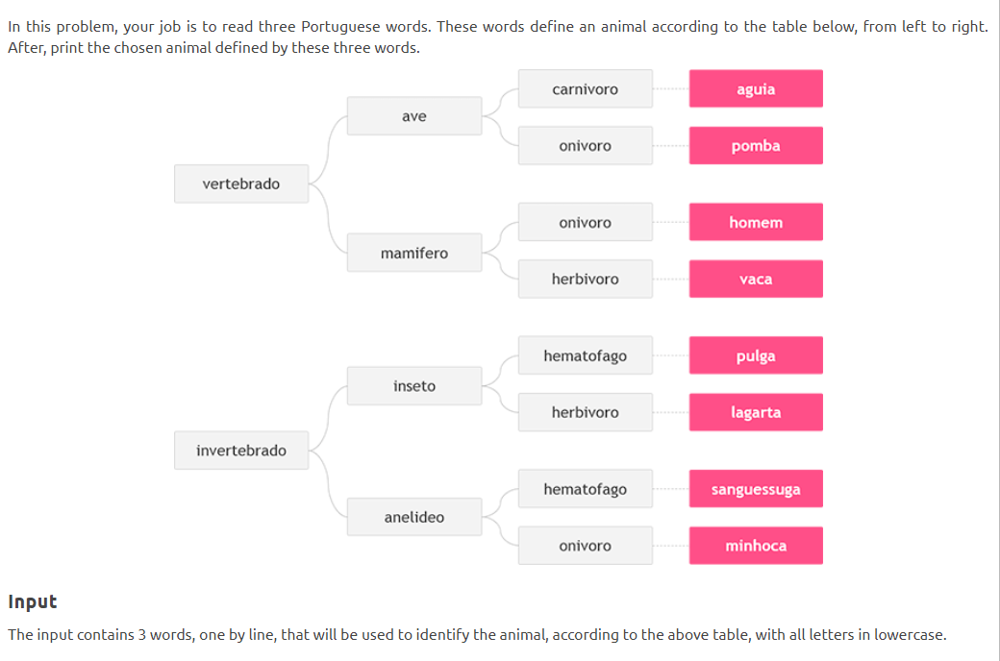

## Exercises Set 1:

> **Refer [all_tests.dart](test/all_test.dart) to run all tests for the exercises**

1- Create a program that asks the user to enter their name and their age. Print out a message that tells how many years
they have to be 100 years old.

2- Ask the user for a number. Depending on whether the number is even or odd, print out an

appropriate message to the user.

3- Take a list, say for example this one:

a = [1, 1, 2, 3, 5, 8, 13, 21, 34, 55, 89]

and write a program that prints out all the elements of the list that are less than 5.

4- Create a program that asks the user for a number and then prints out a list of all the divisors of that number.

If you don’t know what a divisor is, it is a number that divides evenly into another number. For example, 13 is a
divisor of 26 because 26 / 13 has no remainder.

5- Take two lists, for example:

a = [1, 1, 2, 3, 5, 8, 13, 21, 34, 55, 89] b = [1, 2, 3, 4, 5, 6, 7, 8, 9, 10, 11,

12, 13]

and write a program that returns a list that contains only the elements that are common between them (without
duplicates). Make sure your program works on two lists of different sizes.

6- Ask the user for a string and print out whether this string is a palindrome or not.

A palindrome is a string that reads the same forwards and backwards.

Like “Mom , Wow , Dad , smms ,mokom” 7- et’s say you are given a list saved in a variable:

a = [1, 4, 9, 16, 25, 36, 49, 64, 81, 100].

Write a Dart code that takes this list and makes a new list that has only the even elements of this list in it.

8- Make a two-player Rock-Paper-Scissors game against computer.

Ask for player’s input, compare them, print out a message to the winner. 9- Generate a random number between 1 and 100.
Ask the user to guess the number, then tell them whether they guessed too low, too high, or exactly right.

Keep track of how many guesses the user has taken, and when the game ends, print this out.

10- Ask the user for a number and determine whether the number is prime or not.

Do it using a function

11- Write a program that takes a list of numbers for example

a = [5, 10, 15, 20, 25]

and makes a new list of only the first and last elements of the given list. For practice, write this code inside a
function.

12- Write a program (function) that takes a list and returns a new list that contains all the elements of the first list
minus all the duplicates.

13- Write a program (using functions!) that asks the user for a long string containing multiple words. Print back to the
user the same string, except with the words in backwards order.

For example, say I type the string:

My name is Michele

Then I would see the string:

Michele is name My

14- Write a password generator in Dart. Be creative with how you generate passwords - strong passwords have a mix of
lowercase letters, uppercase letters, numbers, and symbols. The passwords should be random, generating a new password
every time the user asks for a new password. Include your run-time code in a main method.

15- Create a program that will play the “cows and bulls” game with the user. The game works like this:

• Randomly generate a 4-digit number. Ask the user to guess a 4digit number. For every digit the user guessed correctly
in the correct place, they have a “cow”. For every digit the user guessed correctly in the wrong place is a “bull.”

• Every time the user makes a guess, tell them how many “cows” and “bulls” they have. Once the user guesses the correct
number, the game is over. Keep track of the number of guesses the user makes throughout the game and tell the user at
the end. 16- Little John wants to calculate and show the amount of spent fuel liters on a trip, using a car that does 12
Km/L. For this, he would like you to help him through a simple program. To perform the calculation, you have to read
spent time (in hours) and the same average speed (km/h). In this way, you can get distance and then, calculate how many
liters would be needed. Show the value with three decimal places after the point.

17- 

18- Make a program that reads five integer values. Count how many of these values are even and print this information

19- Make a program that Read the start time and end time of a game in hours , and tell us how many hours the game
continued but the game will start in a day and end in the next day

20- Read an integer number between 1 and 12, including. Corresponding to this number, you must print the month of the
year, in english, with the first letter in uppercase.

21- When we think of a mobile phone we have three types Samsung , iphone , nokia All of this have some shared attributes
like 1- model , name , screen resolution, operating system And another attributes which is not common Ex : FaceTime on
iphone Please think and build this scenario depends on your knowledge of oop.